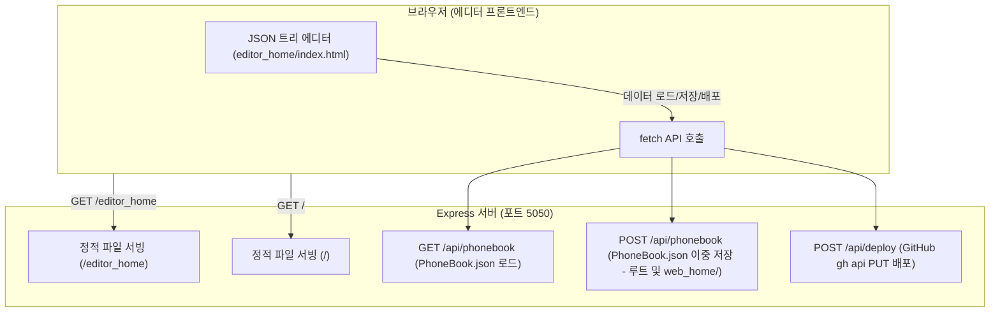

# KCCH 내선번호부 에디터 아키텍처 및 구현 플랜

이 문서는 `KCCH_PhoneBook` 트리 에디터 및 Express API 기반 배포 시스템의 설계 명세를 설명합니다. 
브라우저 CORS 제한과 로컬 파일 쓰기 권한의 한계를 극복하고, 로컬 Git 저장소 유무와 관계없이 `gh` CLI를 이용해 GitHub에 데이터를 안전하게 배포하도록 조치된 단일 서버 아키텍처를 다룹니다.

---

## 1. 아키텍처 개요



| 항목 | 구현 방식 |
|---|---|
| **서버 포트** | **5050** (단일 Express 서버로 뷰어와 에디터 동시 서비스) |
| **JSON 로드** | 페이지 진입 즉시 로컬 루트의 `PhoneBook.json` 자동 로딩 |
| **JSON 저장** | `POST /api/phonebook` API를 호출해 프로젝트 루트 및 `web_home/PhoneBook.json`에 이중 저장 |
| **GitHub 배포** | `Deploy to GitHub` 클릭 시, 서버 API (`POST /api/deploy`)를 통해 **gh api PUT 메서드로 원격 파일 직접 업데이트** |

---

## 2. API 명세

### 2.1 데이터 로드 (`GET /api/phonebook`)
로컬 루트 경로의 `PhoneBook.json`을 읽어 에디터에 JSON 형식으로 제공합니다.

### 2.2 데이터 저장 (`POST /api/phonebook`)
에디터에서 수정된 JSON 트리를 전달받아 `PhoneBook.json` 형식으로 직렬화(4칸 들여쓰기 적용)하여 다음 두 위치에 저장합니다:
- **프로젝트 루트 디렉토리**: `PhoneBook.json`
- **`web_home/` 디렉토리**: `web_home/PhoneBook.json` (이중화 보관)

### 2.3 GitHub 원격 배포 (`POST /api/deploy`)
이 endpoint는 로컬 폴더에 `.git` 폴더가 없거나 Git 리포지토리로 관리되고 있지 않더라도, 로컬 컴퓨터에 로그인된 `gh` (GitHub CLI) 인증 정보를 활용하여 원격 저장소(`bcleemd/kcch-phonebook`)에 `PhoneBook.json` 파일을 직접 푸시합니다.

**배포 동작 프로세스**:
1. `gh api repos/bcleemd/kcch-phonebook/contents/PhoneBook.json` 명령어를 통해 원격에 올라가 있는 기존 파일의 **SHA 키**를 가져옵니다. (PUT 업데이트 시 필수 요구사항)
2. 로컬 `PhoneBook.json`의 내용을 읽은 후 **Base64**로 인코딩합니다.
3. 다음 명령어를 수행하여 변경된 내용만 PUT API 요청으로 업데이트합니다.
   ```bash
   gh api --method PUT repos/bcleemd/kcch-phonebook/contents/PhoneBook.json \
     -f message="[커밋메시지]" \
     -f content="[Base64인코딩텍스트]" \
     -f sha="[SHA값]"
   ```

---

## 3. 에디터 주요 UI 기능

- **인터랙티브 트리**: `PhoneBook.json` 계층형 트리를 그리지며, 접기/펼치기 가능.
- **노드 제어**: 연필 아이콘(✏️)으로 이름 및 연락처 수정, `➕📁`(그룹 추가), `➕📞`(연락처 추가), `🗑️`(삭제) 기능 제공.
- **실시간 검색**: 사이드바 검색창을 통해 장소/이름 입력 시 노드를 자동 전개하며 하이라이트 위치로 스크롤 포커스 이동.
- **헤더 액션 바**: `새로고침`, `저장하기`, `GitHub 배포` 고정 단추 배치.

---

## 4. 실행 및 배포 환경 요구사항

- **Node.js**: `npm run dev` 실행 시 `node server.js`가 port 5050에서 기동합니다.
- **gh CLI**: 배포 기능 작동을 위해 macOS terminal에서 `gh auth login`을 통해 GitHub 계정 인증이 완료되어 있어야 합니다.
